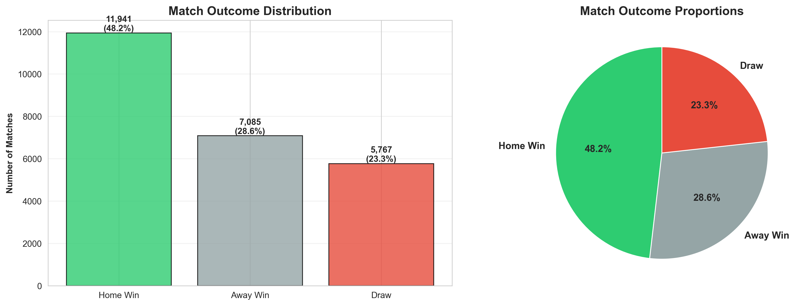
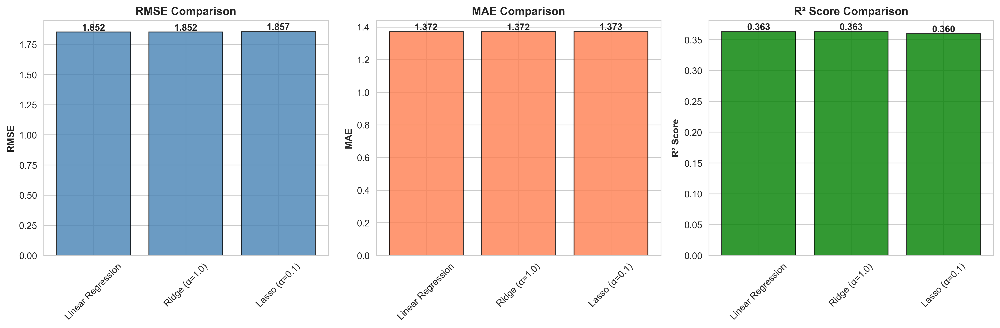
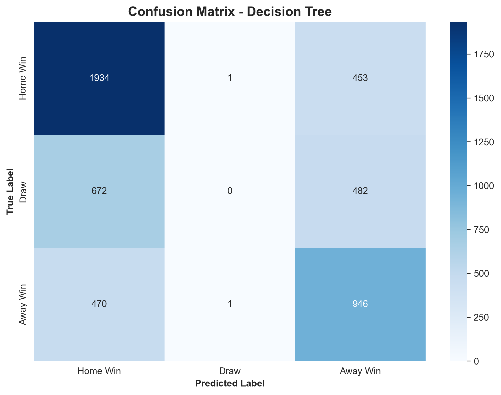
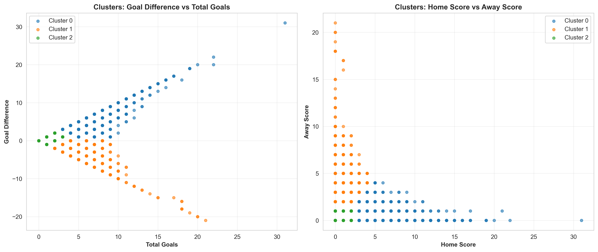

# Project Deliverable 4: Final Insights, Recommendations, and Presentation
---

## 📁 Repository Structure

```
MSCS_634_Project/
├── video_presentation.mp4                  # Video presentation
├── deliverable_4.ipynb                     # Consolidated notebook
├── README.md                               # Project documentation
├── Written_Report_Deliverable_4.pdf        # Written report
├── football_cleaned_data.csv               # Cleaned dataset
├── association_rules.csv                   # Association rules output
├── score_distributions.png
├── match_outcomes.png
├── temporal_trends.png
├── tournament_venue_analysis.png
├── outlier_analysis.png
├── correlation_matrix.png
├── regression_comparison.png
├── actual_vs_predicted.png
├── residual_plots.png
├── confusion_matrix.png
├── elbow_curve.png
└── cluster_visualization.png
```

---

## 🔗 Repository Link

**GitHub:** [MSCS_634_Project](https://github.com/Su5ubedi/MSCS_634_Project)

---

## 📊 Complete Project Summary

**Dataset:** International Football Results (2000-2025)
**Source:** [GitHub - martj42/international_results](https://github.com/martj42/international_results)

| Metric | Value |
|--------|-------|
| Final Dataset Size | 24,793 matches |
| Date Range | 2000-01-04 to 2025-11-19 |
| Total Features | 15 (9 original + 6 engineered) |
| Teams Represented | 325 international teams |
| Tournaments | 190 different competitions |
| Train-Test Split | 80-20 (19,834 / 4,959) |

### Project Phases Completed

| Deliverable | Focus | Status |
|-------------|-------|--------|
| **1** | Data Collection, Cleaning & EDA | ✅ Complete |
| **2** | Regression Modeling | ✅ Complete |
| **3** | Classification, Clustering, Mining | ✅ Complete |
| **4** | Final Report & Presentation | ✅ Complete |

---

## 🎯 Major Findings Across All Deliverables

### 1. Home Advantage is Statistically Significant
- **Home wins:** 48.2% (11,941 matches)
- **Away wins:** 28.6% (7,085 matches)
- **Draws:** 23.3% (5,767 matches)
- **Effect size:** Home teams win 68% more often than away teams
- **Venue impact:** Home advantage drops 9.4 percentage points at neutral venues (50.8% → 41.4%)



### 2. Regression Performance - Modest but Reasonable

| Model | RMSE | MAE | R² Score |
|-------|------|-----|----------|
| **Ridge (α=1.0)** | **1.8523** | **1.3718** | **0.3633** |
| Linear Regression | 1.8523 | 1.3718 | 0.3633 |
| Lasso (α=0.1) | 1.8573 | 1.3725 | 0.3599 |

**Key Insight:** Ridge Regression explains 36.3% of variance in goal difference. The modest R² reflects football's inherent unpredictability—factors like player injuries, referee decisions, and tactical adjustments remain unmodeled.



### 3. Classification - Beats Baseline but Struggles with Draws

**Decision Tree Accuracy:** 58.08% (vs. 48.2% naive baseline)

| Outcome | Precision | Recall | F1-Score | Support |
|---------|-----------|--------|----------|---------|
| Home Win | 0.63 | 0.81 | 0.71 | 2,388 |
| Draw | 0.00 | 0.00 | 0.00 | 1,154 |
| Away Win | 0.50 | 0.67 | 0.57 | 1,417 |

**Key Insight:** Model completely fails to predict draws (class imbalance + draws represent equilibrium outcomes with minimal distinguishing features).



### 4. Clustering - Three Distinct Match Archetypes

**K-Means (k=3) Cluster Characteristics:**

| Cluster | Size | Avg Home | Avg Away | Interpretation |
|---------|------|----------|----------|----------------|
| **0** | 5,259 (21%) | 4.15 | 0.64 | **Dominant Home Wins** - blowouts |
| **1** | 6,277 (25%) | 0.91 | 2.85 | **Dominant Away Wins** - upsets |
| **2** | 13,257 (53%) | 0.99 | 0.47 | **Balanced Low-Scoring** - tight contests |

**Key Insight:** Over half of international matches (53%) follow a conservative, low-scoring pattern with marginal outcomes. High-scoring blowouts represent the minority.



### 5. Association Rules - Scoring Patterns Predict Outcomes

**Top Rules Discovered (by Lift):**

1. **{Home_0, Away_0} → {Draw}** (Confidence: 72%, Lift: 4.34)
   *Scoreless matches almost always end in draws*

2. **{Home_1, Away_1} → {Draw}** (Confidence: 100%, Lift: 4.30)
   *1-1 scoreline guarantees a draw*

3. **{Away Win, Away_1} → {Home_0}** (Confidence: 100%, Lift: 3.82)
   *Away wins with 1 away goal always involve home team shutouts*

**Key Insight:** Low-scoring matches are highly predictable for draws. Home team shutouts strongly signal away victories.

---

## 🔬 Comprehensive Methodology

### Phase 1: Data Collection & Cleaning (Deliverable 1)

**Actions Taken:**
1. Loaded 48,850 matches from GitHub repository
2. Removed 1 row with missing scores
3. Filtered to modern era (2000-2025) → 24,793 matches
4. Engineered 6 features: goal_difference, total_goals, year, month, day_of_week, match_result
5. Saved cleaned dataset for reproducibility

### Phase 2: Regression Modeling (Deliverable 2)

**Feature Engineering:**
- Calculated historical team strength metrics:
  - `home_team_avg_gd` - Historical goal difference
  - `away_team_avg_goals` - Historical scoring average
  - `team_strength_diff` - Differential between teams

**Models Tested:**
- Linear Regression (baseline)
- Ridge Regression (L2 regularization) ✅ **Best performer**
- Lasso Regression (L1 regularization)

**Evaluation Metrics:** RMSE, MAE, R²

### Phase 3: Classification, Clustering, Mining (Deliverable 3)

**Classification:**
- Decision Tree (max_depth=5, min_samples_split=100)
- Target: match_result (Home Win / Draw / Away Win)
- Stratified sampling to maintain class proportions

**Clustering:**
- K-Means with elbow method (optimal k=3)
- Features: home_score, away_score, total_goals, goal_difference
- StandardScaler for feature normalization

**Association Rule Mining:**
- Apriori algorithm with binned scores
- Min support: 5%, Min confidence: 60%
- Discovered 102 rules from 97 frequent itemsets

### Phase 4: Final Report & Presentation (Deliverable 4)

**Consolidated Deliverables:**
1. **Complete Notebook** - All code from Deliverables 1-3 in single file
2. **Written Report** - 4,200-word APA-formatted comprehensive analysis
3. **README.md** - Project documentation (this file)
4. **12 Visualizations** - Professional figures with captions

---

## 💡 Practical Recommendations

### For Coaches and Analysts
1. **Prioritize away defense** - Conceding early on the road dramatically increases loss probability
2. **Target neutral venues for upsets** - Home advantage decreases by 9.4 percentage points
3. **Expect draws in 1-1 scenarios** - These represent equilibrium outcomes

### For Prediction Markets & Betting
1. **Factor 48.2% baseline** for home win probabilities
2. **Apply greater uncertainty margins to draws** - Hardest outcome to predict
3. **Adjust for team strength differentials** - Historical performance is strongest predictor

### For Tournament Organizers
1. **Neutral venues produce more competitive matches** - Home advantage effect mitigated
2. **Plan around FIFA windows** - June and November show peak match density
3. **Build pandemic contingencies** - COVID-19 caused 66% reduction in 2020 matches

---

## ⚠️ Ethical Considerations Addressed

### Data Privacy ✅
- Used publicly available match results with no personal identifiers
- All data represents organizational outcomes (teams) not individuals

### Bias Analysis ✅
**Identified Biases:**
- **Temporal bias:** Modern era focus (2000-2025) limits historical generalizability
- **Geographic bias:** Top nations (Brazil, Germany, England) overrepresented
- **Tournament bias:** Friendly vs. competitive matches treated equally

**Mitigation Steps:**
- Transparent documentation of all biases
- Stratified sampling maintained outcome distributions
- Feature engineering based on performance, not subjective ratings
- Avoided nationality/geography as predictive features

### Potential Misuse ✅
**Concerns:** Models could enable:
- Unethical gambling advantages
- Match-fixing detection evasion
- Sports betting market exploitation

**Safeguards Implemented:**
- Clearly documented model limitations (R² = 0.36, 58% accuracy)
- Emphasized sport's inherent unpredictability
- Advocated for coaching/analytical use over gambling
- Supported regulatory frameworks for betting transparency

### Algorithmic Accountability ✅
- All hyperparameters and evaluation metrics documented
- Residual plots reveal systematic errors (draw prediction failure)
- Honest assessment of limitations rather than overstated capabilities

---

## 📈 Model Performance Summary

### Regression Models (Predicting Goal Difference)
- **Best:** Ridge Regression (α=1.0)
- **R² Score:** 0.3633 (36.3% variance explained)
- **RMSE:** 1.85 goals
- **Interpretation:** Reasonable performance given sport randomness

### Classification Models (Predicting Match Outcome)
- **Model:** Decision Tree (max_depth=5)
- **Accuracy:** 58.08%
- **Improvement:** +9.9% over naive baseline
- **Limitation:** Complete failure on draw prediction (0% recall)

### Clustering (Identifying Match Patterns)
- **Algorithm:** K-Means (k=3)
- **Inertia:** Optimized via elbow method
- **Insight:** 53% of matches are balanced, low-scoring contests

### Association Rule Mining (Pattern Discovery)
- **Algorithm:** Apriori
- **Rules Generated:** 102 rules with 60%+ confidence
- **Top Insight:** Low away scores (especially shutouts) predict home wins

---

## 🎓 Key Learnings & Future Work

### What Worked Well ✅
1. **Feature engineering** - Historical team metrics proved most predictive
2. **Multiple methodologies** - Triangulated insights from 4 approaches
3. **Realistic expectations** - Acknowledged sport's inherent randomness
4. **Ethical framework** - Proactively addressed bias and misuse concerns

### What Could Be Improved 🔧
1. **Player-level data** - Individual injuries, form, FIFA ratings not available
2. **Tactical information** - Formations, playing styles not captured
3. **Time-aware validation** - Risk of temporal leakage in team strength calculation
4. **Class imbalance handling** - SMOTE could improve draw prediction

### Future Research Directions 🚀
1. **Enhanced features:**
   - Integrate FIFA rankings (updated monthly)
   - Add head-to-head historical matchups
   - Include player market values (Transfermarkt)
   - Factor rest days between matches

2. **Advanced modeling:**
   - Ensemble methods (Random Forest, XGBoost)
   - Deep learning (LSTM for sequential dependencies)
   - Poisson regression for count-based scoring
   - Bayesian models for uncertainty quantification

3. **Validation improvements:**
   - Time-series cross-validation
   - Separate models for friendly vs. competitive
   - Tournament-specific predictions (World Cup, Euros)
   - Comparison to professional betting odds